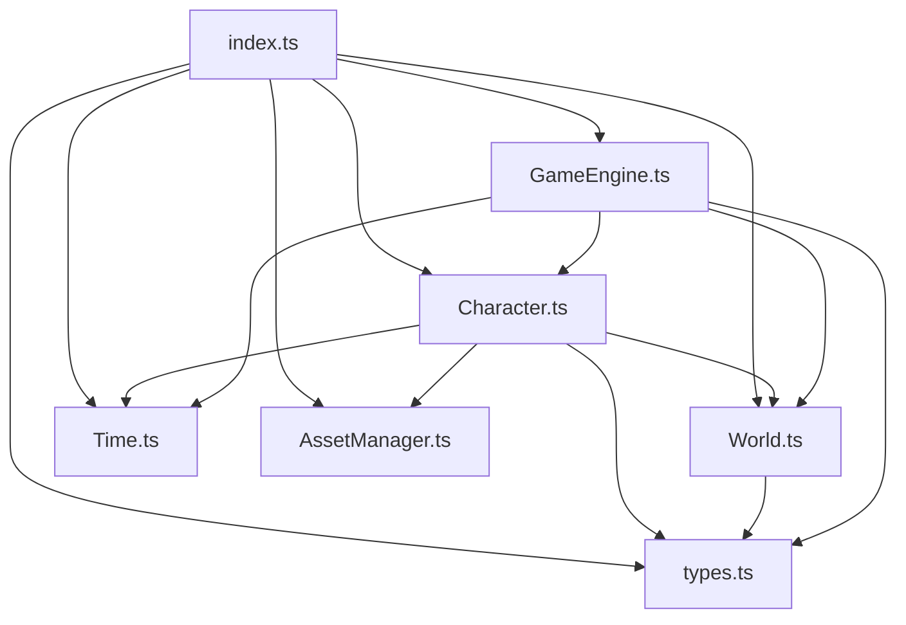

# Gameplan RPG Game Mode - Technical Documentation

## Overview

A 2D tile-based RPG game engine built with TypeScript and HTML5 Canvas, featuring character movement, animations, and a modular architecture.

## Architecture

### Core Components

The game engine is split into focused, single-responsibility modules:

```
gamemode/
- types.ts          # Shared TypeScript interfaces
- Time.ts           # Global delta time management
- AssetManager.ts   # Asset path utilities
- World.ts          # Game world rendering
- Character.ts      # Character logic & animations
- GameEngine.ts     # Main game orchestration
- index.ts          # Public API exports
```

## Quick Start

```typescript
import { GameEngine } from '@/gamemode'

// Create engine with canvas element
const engine = new GameEngine(canvasElement)

// Start the game loop
engine.start()

// Clean up when done
engine.destroy()
```

## Core Classes

### GameEngine

**Purpose**: Orchestrates the entire game, handles input, and manages the game loop.

**Key Methods**:

- `start()` - Begin the game loop
- `pause()` - Pause the game
- `stop()` - Stop the game loop
- `destroy()` - Clean up resources
- `createCharacter(number)` - Add a new character

**Game Loop**:

1. Process keyboard input (WASD/Arrow keys)
2. Update all characters (animation, movement)
3. Render world background and grid
4. Render all characters
5. Display debug information (FPS, player count)

### Character

**Purpose**: Handles character sprites, animations, movement, and rendering.

**Properties**:

- `width: 48px` - Character sprite width
- `height: 96px` - Character sprite height
- `speed` - Calculated from `tileSize � tilesPerSecond`

**Animations**:

- **Idle**: 6-frame cycle for standing still
- **Walk**: 6-frame cycle for movement
- **Directions**: Down, Left, Right, Up (4 directions)

**Factory Methods**:

```typescript
// Create specific character (1-20)
Character.createWithCharacterNumber(5, world)

// Create random character
Character.createRandom(world)
```

### World

**Purpose**: Renders the game environment (background, grid) and provides world boundaries.

**Configuration**:

- **Size**: 768�576 pixels (16�12 tiles)
- **Tile Size**: 48�48 pixels (matches LimeZu assets)
- **Grid**: Visual tile system overlay
- **Colors**: Dark background (`#2a2a2a`), subtle grid (`#444`)

### AssetManager

**Purpose**: Centralized management of game asset paths.

**Available Characters**: 20 premade LimeZu character sprites (`01` through `20`)

**Methods**:

```typescript
// Get specific character sprite
AssetManager.getCharacterSpritePath(5)
// � "/assets/gameplan/pod-assets/2_Characters/.../Premade_Character_48x48_05.png"

// Get random character sprite
AssetManager.getRandomCharacterSpritePath()

// Get all character numbers [1, 2, 3, ..., 20]
AssetManager.getAllCharacterNumbers()
```

### Time

**Purpose**: Global delta time management for frame-rate independent animations.

**Usage**:

```typescript
// Engine sets delta time each frame
Time.setDeltaTime(deltaTime)

// Characters use it for movement
const moveDistance = speed * (Time.getDeltaTime() / 1000)
```

## Character System

### Sprite Sheet Structure

LimeZu characters use a 24-frame horizontal layout per row:

```
Row 1 (Idle): [Right6][Up6][Left6][Down6]
Row 2 (Walk): [Right6][Up6][Left6][Down6]
```

### Movement System

- **Grid-based**: Movement aligned to 48�48 pixel tiles
- **Speed**: Configurable as "tiles per second" (default: 2 tiles/sec = 96 px/sec)
- **Smooth**: Uses delta time for consistent speed across different frame rates
- **Bounded**: Characters cannot move outside world boundaries

### Controls

- **WASD** or **Arrow Keys** for movement
- **Multiple keys**: Supports diagonal movement
- **Animation sync**: Walking animation plays during movement, idle when stopped

## Technical Details

### Performance

- **60 FPS target**: Uses `requestAnimationFrame` for smooth animation
- **Canvas rendering**: Direct 2D context drawing for optimal performance
- **Efficient updates**: Only processes sprite animations when needed

### Asset Loading

- **Asynchronous**: Character sprites load in the background
- **Fallback**: Characters don't render until sprite is loaded
- **Paths**: Centralized in AssetManager for easy maintenance

### Input System

- **Event-driven**: Uses keyboard event listeners
- **State tracking**: Maintains pressed key state for smooth movement
- **Clean up**: Properly removes event listeners on engine destruction

## Usage Examples

### Basic Setup (Vue.js)

```vue
<script setup lang="ts">
import { onMounted, onUnmounted, ref, useTemplateRef } from 'vue'
import { GameEngine } from '@/gamemode'

const canvasRef = useTemplateRef<HTMLCanvasElement>('canvas')
const engine = ref<GameEngine | null>(null)

onMounted(() => {
  if (canvasRef.value) {
    engine.value = new GameEngine(canvasRef.value)
    engine.value.start()
  }
})

onUnmounted(() => {
  engine.value?.destroy()
})
</script>

<template>
  <canvas ref="canvas"></canvas>
</template>
```

### Creating Additional Characters

```typescript
// Add a specific character at runtime
const character = engine.createCharacter(10) // Character #10

// Characters spawn at random positions with idle animation
// Player character is automatically created and centered
```

### Character Configuration

```typescript
// Custom movement speed
const fastCharacter = Character.createWithCharacterNumber(1, world, {
  tilesPerSecond: 3, // Faster than default 2 tiles/sec
})

// Position manually
character.setPosition(100, 200)

// Control animation
character.setAnimation('walk')
character.setDirection('up')
```

## File Relationships



## Future Extensions

The modular architecture makes it easy to add:

- **Sound.ts**: Audio management and music
- **Network.ts**: Multiplayer functionality
- **UI.ts**: Game interface overlays
- **Physics.ts**: Advanced collision detection
- **Items.ts**: Collectibles and inventory system

## Development Notes

- **TypeScript**: Full type safety throughout
- **No external dependencies**: Built with browser APIs only
- **Vue.js integration**: Designed for Vue 3 Composition API
- **Asset compatibility**: Optimized for LimeZu 48�48 pixel art style
- **Extensible**: Clean interfaces for adding new features
